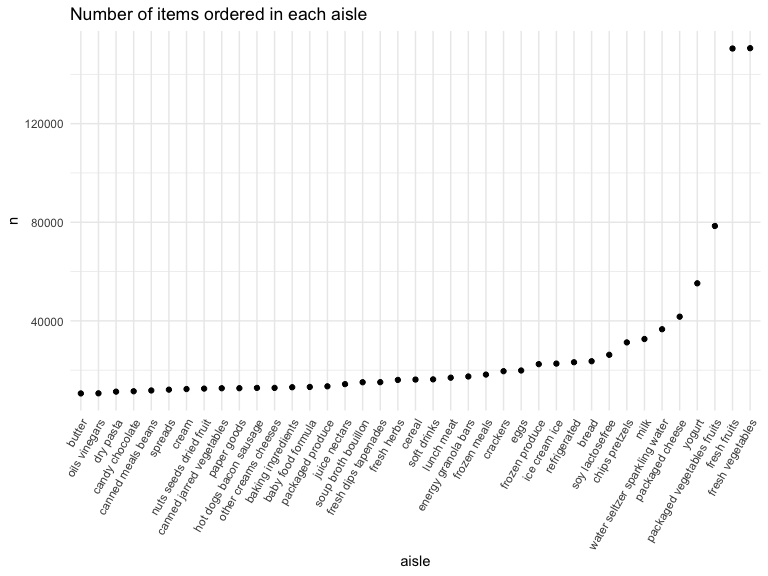

p8105_hw3_jy3269
================
Jingyi Yao
2022-10-17

``` r
library(tidyverse)
library(ggridges)
library(patchwork)
library(p8105.datasets)

knitr::opts_chunk$set(
    echo = TRUE,
    warning = FALSE,
    fig.width = 8, 
  fig.height = 6,
  out.width = "90%"
)

theme_set(theme_minimal() + theme(legend.position = "bottom"))

options(
  ggplot2.continuous.colour = "viridis",
  ggplot2.continuous.fill = "viridis"
)

scale_colour_discrete = scale_colour_viridis_d
scale_fill_discrete = scale_fill_viridis_d
```

## Problem 1

#### Read in the data

``` r
data("instacart")

instacart = 
  instacart %>% 
  as_tibble(instacart)
```

#### Answer questions about the data

This dataset contains 1384617 rows and 15 columns, with each row
resprenting a single product from an instacart order. Variables include
identifiers for user, order, and product; the order in which each
product was added to the cart. There are several order-level variables,
describing the day and time of the order, and number of days since prior
order. Then there are several item-specific variables, describing the
product name (e.g. Yogurt, Avocado), department (e.g. dairy and eggs,
produce), and aisle (e.g. yogurt, fresh fruits), and whether the item
has been ordered by this user in the past. In total, there are 39123
products found in 131209 orders from 131209 distinct users.

Below is a table summarizing the number of items ordered from aisle. In
total, there are 134 aisles, with fresh vegetables and fresh fruits
holding the most items ordered by far.

``` r
instacart %>% 
  count(aisle) %>% 
  arrange(desc(n))
```

    ## # A tibble: 134 × 2
    ##    aisle                              n
    ##    <chr>                          <int>
    ##  1 fresh vegetables              150609
    ##  2 fresh fruits                  150473
    ##  3 packaged vegetables fruits     78493
    ##  4 yogurt                         55240
    ##  5 packaged cheese                41699
    ##  6 water seltzer sparkling water  36617
    ##  7 milk                           32644
    ##  8 chips pretzels                 31269
    ##  9 soy lactosefree                26240
    ## 10 bread                          23635
    ## # … with 124 more rows

Next is a plot that shows the number of items ordered in each aisle.
Here, aisles are ordered by ascending number of items.

``` r
instacart %>% 
  count(aisle) %>% 
  filter(n > 10000) %>% 
  mutate(aisle = fct_reorder(aisle, n)) %>% 
  ggplot(aes(x = aisle, y = n)) + 
  geom_point() + 
  labs(title = "Number of items ordered in each aisle") +
  theme(axis.text.x = element_text(angle = 60, hjust = 1))
```



Our next table shows the three most popular items in aisles
`baking ingredients`, `dog food care`, and `packaged vegetables fruits`,
and includes the number of times each item is ordered in your table.

``` r
instacart %>% 
  filter(aisle %in% c("baking ingredients", "dog food care", "packaged vegetables fruits")) %>%
  group_by(aisle) %>% 
  count(product_name) %>% 
  mutate(rank = min_rank(desc(n))) %>% 
  filter(rank < 4) %>% 
  arrange(desc(n)) %>%
  knitr::kable()
```

| aisle                      | product_name                                  |    n | rank |
|:---------------------------|:----------------------------------------------|-----:|-----:|
| packaged vegetables fruits | Organic Baby Spinach                          | 9784 |    1 |
| packaged vegetables fruits | Organic Raspberries                           | 5546 |    2 |
| packaged vegetables fruits | Organic Blueberries                           | 4966 |    3 |
| baking ingredients         | Light Brown Sugar                             |  499 |    1 |
| baking ingredients         | Pure Baking Soda                              |  387 |    2 |
| baking ingredients         | Cane Sugar                                    |  336 |    3 |
| dog food care              | Snack Sticks Chicken & Rice Recipe Dog Treats |   30 |    1 |
| dog food care              | Organix Chicken & Brown Rice Recipe           |   28 |    2 |
| dog food care              | Small Dog Biscuits                            |   26 |    3 |

Finally is a table showing the mean hour of the day at which Pink Lady
Apples and Coffee Ice Cream are ordered on each day of the week. This
table has been formatted in an untidy manner for human readers. Pink
Lady Apples are generally purchased slightly earlier in the day than
Coffee Ice Cream, with the exception of day 5.

``` r
instacart %>%
  filter(product_name %in% c("Pink Lady Apples", "Coffee Ice Cream")) %>%
  group_by(product_name, order_dow) %>%
  summarize(mean_hour = mean(order_hour_of_day)) %>%
  spread(key = order_dow, value = mean_hour) %>%
  knitr::kable(digits = 2)
```

    ## `summarise()` has grouped output by 'product_name'. You can override using the
    ## `.groups` argument.

| product_name     |     0 |     1 |     2 |     3 |     4 |     5 |     6 |
|:-----------------|------:|------:|------:|------:|------:|------:|------:|
| Coffee Ice Cream | 13.77 | 14.32 | 15.38 | 15.32 | 15.22 | 12.26 | 13.83 |
| Pink Lady Apples | 13.44 | 11.36 | 11.70 | 14.25 | 11.55 | 12.78 | 11.94 |

## Problem 2

### 1. import csv file

``` r
data_1 <- read_csv("./data/accel_data.csv")
```

    ## Rows: 35 Columns: 1443
    ## ── Column specification ────────────────────────────────────────────────────────
    ## Delimiter: ","
    ## chr    (1): day
    ## dbl (1442): week, day_id, activity.1, activity.2, activity.3, activity.4, ac...
    ## 
    ## ℹ Use `spec()` to retrieve the full column specification for this data.
    ## ℹ Specify the column types or set `show_col_types = FALSE` to quiet this message.

### 2. clean, tidy and wrangle data

``` r
acc_1 <- data_1 %>% 
  janitor::clean_names() %>% 
  mutate(
    week = as.integer(week),
    day_id = as.integer(day_id),
    day = factor(day,levels= c("Monday", 
    "Tuesday", "Wednesday", "Thursday", "Friday", "Saturday","Sunday")),
    weekday_vs_weekend = if_else(day == "Saturday" | day == "Sunday","weekend","weekday") # new variable indicate whether the day is weekend or weekday
  ) %>% 
  pivot_longer(                          # switch the data set from wider to longer
    activity_1:activity_1440,
    names_to = "minute",                 # activity_number in previous column names indicate the minute       
    names_prefix = "activity_",          # remove the activity_ prefix and preserve the number
    values_to = "activity_counts") %>%   # store the observed data in a new column names activity_counts
  mutate(minute = as.integer(minute))    # change data type

head(acc_1)
```

    ## # A tibble: 6 × 6
    ##    week day_id day    weekday_vs_weekend minute activity_counts
    ##   <int>  <int> <fct>  <chr>               <int>           <dbl>
    ## 1     1      1 Friday weekday                 1            88.4
    ## 2     1      1 Friday weekday                 2            82.2
    ## 3     1      1 Friday weekday                 3            64.4
    ## 4     1      1 Friday weekday                 4            70.0
    ## 5     1      1 Friday weekday                 5            75.0
    ## 6     1      1 Friday weekday                 6            66.3

**Description**:

-   the `acc_1` data set has 50400 rows (observations) and 6 columns
    (variables)
-   the variables in `acc_1` include : week, day_id, day,
    weekday_vs_weekend, minute, activity_counts
-   the `weekday_vs_weekend` variable is a new one added to the original
    data set, showing whether the day is a weekday or a weekend.
-   the original data set `data_1` has 1443 variables. The last 1440
    columns are the activity counts of each minute in a day.
-   We used `pivot_longer` to transform the 1440 columns to store the
    data in a new variable named `activity_counts` and specify the
    minute each data belongs to in a new variable named `minute`.

### 3. calculate total activity each day + make a table

``` r
acc_1 %>% 
  group_by(week,day) %>% 
  summarize(total_activity = sum(activity_counts)) %>% 
  arrange(week,day) %>%       # organize data in a tidy order
  pivot_wider(
    names_from = day,
    values_from = total_activity
  ) %>% 
  knitr::kable()
```

    ## `summarise()` has grouped output by 'week'. You can override using the
    ## `.groups` argument.

| week |    Monday |  Tuesday | Wednesday | Thursday |   Friday | Saturday | Sunday |
|-----:|----------:|---------:|----------:|---------:|---------:|---------:|-------:|
|    1 |  78828.07 | 307094.2 |    340115 | 355923.6 | 480542.6 |   376254 | 631105 |
|    2 | 295431.00 | 423245.0 |    440962 | 474048.0 | 568839.0 |   607175 | 422018 |
|    3 | 685910.00 | 381507.0 |    468869 | 371230.0 | 467420.0 |   382928 | 467052 |
|    4 | 409450.00 | 319568.0 |    434460 | 340291.0 | 154049.0 |     1440 | 260617 |
|    5 | 389080.00 | 367824.0 |    445366 | 549658.0 | 620860.0 |     1440 | 138421 |

**Description of the table** :

-   The daily total activities tend to fluctuate within each week, thus
    there is no obvious trends.
-   The daily total activity counts on Saturday in Week 4 and 5 are both
    1440 which means the activity counts is 1 for each minute. The data
    seems abnormal. I suppose that there might be something wrong with
    the Accelerator that makes it unable to collect data correctly.

To better discover the trends during each week, we may make a plot.

# 4. Plot the trend of each week

``` r
acc_1 %>% 
  group_by(week,day) %>% 
  summarize(total_activity = sum(activity_counts)) %>% 
  arrange(week,day) %>%                             # use part of the code from making the previous table
  ggplot(aes(x = day, y = total_activity, color = week, group = week)) +
  geom_point() + geom_line() + facet_grid(~week) +  # place the 5 plots in a row in the order of weeks
  labs(
  title = "Activity Trend",
  x = "Day",
  y = "Daily Total Activity") +
  theme(axis.text.x = element_text(angle = 90, vjust = 0.5, hjust = 1), 
        legend.position = "none")
```

    ## `summarise()` has grouped output by 'week'. You can override using the
    ## `.groups` argument.


**Description of the trend plot**:

-   In week 1 and 2, the total activity per day increases from Monday to
    Friday.
-   In Week 3 and 4, the fluctuations are more irregular.
-   Week 5 shows an approximately increasing trend from Monday to
    Friday.
-   The abnormal data on the Saturday of Week 4 and 5 is more obvious in
    the plot.

### 5. plot daily activity

``` r
acc_1 %>%  
  group_by(day_id) %>%
  ggplot(aes(x = minute,y = activity_counts,color = day)) +
  geom_line() +
  theme(legend.position = "bottom")+
  labs(
    title = "Daily Activity",
    x = "Time in a Day",
    y = "Activity Count")+
  scale_x_continuous(
    breaks = c(0,180,360,540,720,900,1080,1260,1440),   # set the breaks of minutes in a day
    labels = c("12AM","3AM","6AM","9AM","12PM","3PM","6PM","9PM","12AM"),  # more readable x-axis labels
    limits = c(0,1440))
```


**Description**:

-   Within each day, the man tend to be more active from 6 am to around
    10 pm and less active from 11 pm to 6 am. This is probably because
    he goes to sleep at around 11 pm and wakes up t aound 6 am.
-   There is a significant peak in yellow around 11 am to 12 pm, which
    implies that the man is particularly active at noon on Sundays.
-   Another peak in various colors is around 7 pm to 10 pm, which means
    that the man is very active almost each day during this time period.
    In the peak, there seems to be more green lines than other colored
    lines, implying that the man is more active on Fridays during this
    time period.

## Problem 3

### 1. load `ny_noaa` data set and explore its structure

``` r
data("ny_noaa")

num_weather_station <- length(unique(ny_noaa$id))  # number of missing values

no_missing = na.omit(ny_noaa)                      # data removed of the NAs
num_no_missing <- nrow(no_missing)                 # number of rows without missing values
missing_proportion <- (nrow(ny_noaa) - nrow(no_missing))/nrow(ny_noaa)*100   # missing proportion


# missing proportion in each variables
ny_noaa %>% 
  summarise_at(vars(prcp:tmin), .funs = function(x) mean(is.na(x))) %>%
  round(digits = 3) %>% 
  knitr::kable()
```

|  prcp |  snow |  snwd |  tmax |  tmin |
|------:|------:|------:|------:|------:|
| 0.056 | 0.147 | 0.228 | 0.437 | 0.437 |

**Description of the raw dataset `ny_noaa`**:

-   `ny_noaa` has 2595176 observations and 7 variables.

-   The variables are : names(ny_noaa)

-   id: Weather station ID

-   date: Date of observation

-   prcp: Precipitation (tenths of mm)

-   snow: Snowfall (mm)

-   snwd: Snow depth (mm)

-   tmax: Maximum temperature (tenths of degrees C)

-   tmin: Minimum temperature (tenths of degrees C)

-   The key variables are `prcp` `snow` `snwd` `tmax` and `tmin`

-   The observations ranging from 1981-01-01 to 2010-12-31

-   There are 747 different weather stations.

**The missing value problem**:

-   There are a total of 1372743 rows that contains missing data, which
    is 52.89595% of the total observations.
-   It means that more than half of the `ny_noaa` data set have missing
    values.Therefore, missing data is a big issue.
-   The missing value proportion of the 5 key variables are shown in the
    table : 44% missing for max and min temperature , 23% for snow
    depth, 15% for snow, and 6% for precipitation.

### 2. clean data

``` r
noaa <- ny_noaa %>%
  janitor::clean_names() %>%
  separate(date, c("year", "month", "day"), sep = "-", convert = TRUE) %>%
  mutate(
    month = month.name[as.integer(month)],
    prcp = prcp / 10,
    tmax = as.numeric(tmax) / 10, 
    tmin = as.numeric(tmin) / 10    # switch to proper units
    )
noaa
```

    ## # A tibble: 2,595,176 × 9
    ##    id           year month      day  prcp  snow  snwd  tmax  tmin
    ##    <chr>       <int> <chr>    <int> <dbl> <int> <int> <dbl> <dbl>
    ##  1 US1NYAB0001  2007 November     1    NA    NA    NA    NA    NA
    ##  2 US1NYAB0001  2007 November     2    NA    NA    NA    NA    NA
    ##  3 US1NYAB0001  2007 November     3    NA    NA    NA    NA    NA
    ##  4 US1NYAB0001  2007 November     4    NA    NA    NA    NA    NA
    ##  5 US1NYAB0001  2007 November     5    NA    NA    NA    NA    NA
    ##  6 US1NYAB0001  2007 November     6    NA    NA    NA    NA    NA
    ##  7 US1NYAB0001  2007 November     7    NA    NA    NA    NA    NA
    ##  8 US1NYAB0001  2007 November     8    NA    NA    NA    NA    NA
    ##  9 US1NYAB0001  2007 November     9    NA    NA    NA    NA    NA
    ## 10 US1NYAB0001  2007 November    10    NA    NA    NA    NA    NA
    ## # … with 2,595,166 more rows

-   `noaa` has 2595176 rows and 9 columns.
-   The variables in `noaa` are : id, year, month, day, prcp, snow,
    snwd, tmax, tmin
-   The key variables are `prcp` `snow` `snwd` `tmax` and `tmin`
-   the units of precipitation, min and max temperature are adjusted.

### 3. snowfall

``` r
noaa %>% 
  group_by(snow) %>% 
  summarise(frequency = n()) %>%  # count the occurrence of each observed snowfall data
  arrange(desc(frequency))        # arrange the data in descending order to find the most frequent ones
```

    ## # A tibble: 282 × 2
    ##     snow frequency
    ##    <int>     <int>
    ##  1     0   2008508
    ##  2    NA    381221
    ##  3    25     31022
    ##  4    13     23095
    ##  5    51     18274
    ##  6    76     10173
    ##  7     8      9962
    ##  8     5      9748
    ##  9    38      9197
    ## 10     3      8790
    ## # … with 272 more rows

The most commonly observed values of snowfall variable in the data set
is 0, which implies that there is no snow for most of the time in New
York.

One reason for this is that winter only takes up a small proportion of
the time range for the observations. And New York almost only snows in
winter.

Another supplementary reason why New York does not snow very often even
in winter is that the climate of New York state is humid continental.
The average winter temperature is below 0 during January and February in
most cities in the state. But it is usually several degrees above 0
along the Atlantic coastline, including New York City, making it hard to
snow.

### 4. plot mean tmax

``` r
noaa %>%
  filter(month == 'January' | month == 'July') %>%
  group_by(month, id, year) %>%
  summarize(mean_tmax = mean(tmax, na.rm = TRUE)) %>%
  ggplot(aes(x = year, y = mean_tmax, color = month)) +
  geom_point(alpha = .2) +
  geom_smooth(se = F,color = "black")+    # add a black line to show the trend
  facet_grid(~month) +
  labs(x = "Year",
       y = "Average Max Temperature (C)",
       title = "Average Max Temperature in January and July") +
  theme_bw() +
  theme(legend.position = "bottom")
```

    ## `summarise()` has grouped output by 'month', 'id'. You can override using the
    ## `.groups` argument.
    ## `geom_smooth()` using method = 'gam' and formula 'y ~ s(x, bs = "cs")'


**Description**

-   The mean tmax in January is much lower than that in July.
-   The range of mean tmax in January is around -10 to 10 (degree C), in
    July is around 20 to 35 (degree C). Thus, Jan has a larger range
    than July.
-   There are outliers in both January and July.
-   In January, there are extremely low mean tmax lower than -10 and
    extremely high mean tmax above 10.
-   In July, there are also extremely high mean tmax close to 35 and
    extremely low mean tmax lower than 15.
-   The average mean tmax in January across the years is centered around
    0 degree C, while that in July the average is centered around 27
    degree C.
-   We can tell from the black line that the mean tax in January
    fluctuates more wildly than that in July.

## 5. plot tmax vs tmin + distribution of snowfall

``` r
tmax_tmin_plot <-                         # tmax vs tmin
  noaa %>% 
  ggplot(aes(x = tmax,y = tmin)) +
  geom_hex() +                            # use a hexagon plot
  geom_smooth(se = FALSE,na.rm = TRUE) +
  labs(x = "tmax(C)",y = "tmin(C)",title = "tmax vs tmin") +
  theme(legend.text = element_text(size = 8),
        legend.key.width = unit(1,'cm'))  # set the legend text size and width

  
snow_density_plot <-                      # snow density
  noaa %>% 
  filter(snow > 0 & snow < 100) %>% 
  mutate(year = factor(year)) %>% 
  ggplot(aes(x = snow, y = year,fill = year)) + 
  geom_density_ridges()+
  labs(
    y = "Year",
    x = "Snowfall (mm)",
    title = "The distribution of snowfall")  + 
  theme(legend.position = "none")


 tmax_tmin_plot + snow_density_plot 
```

    ## `geom_smooth()` using method = 'gam' and formula 'y ~ s(x, bs = "cs")'

    ## Picking joint bandwidth of 3.76


**Description**

-   The left figure is a plot of tmax vs tmin from 1980 to 2010. It
    shows that most of the points fall into the center of the plot,
    where tmax ranges from 0 to 30 and tmin ranges from -15 to 20.
-   The right figure is the distribution of snowfall over the years and
    each curve represents a year.
-   Although the distribution of snow are slightly different from year
    to year, they all share a similar pattern.
-   The pattern shows that : the highest density is between 0 mm to 25
    mm, and the lowest is greater than 90 mm. It means that the snowfall
    is usually between 0 mm to 25 mm and rarely over 90 mm.
